# Motion planning via sparse GP trajectory and factor graph  

A matlab repository containing utils and demos of sparse GP, aiming to explore the potential of this special formulation in motion planning problems.  

**Reference:**  

    [1] Mukadam, Mustafa, et al. "Continuous-time Gaussian process motion planning via probabilistic inference." The International Journal of Robotics Research 37.11 (2018): 1319-1340.  

    [2] Anderson, Sean, et al. "Batch nonlinear continuous-time trajectory estimation as exactly sparse Gaussian process regression." Autonomous Robots 39 (2015): 221-238. 
    
    [3] Dong, Jing, et al. "Sparse Gaussian processes on matrix lie groups: A unified framework for optimizing continuous-time trajectories." 2018 IEEE International Conference on Robotics and Automation (ICRA). IEEE, 2018.  


**Requirements:**  

- `matlab version >= 2019`
  - `robotics system tool box`
  - `image processing tool box`
  - `optimization tool box`  


## 1.sparse GP derived from SDE  

source code in `\GP_modules`   

### (1) 1-D sparse GP smoothing
`min-Acc prior`
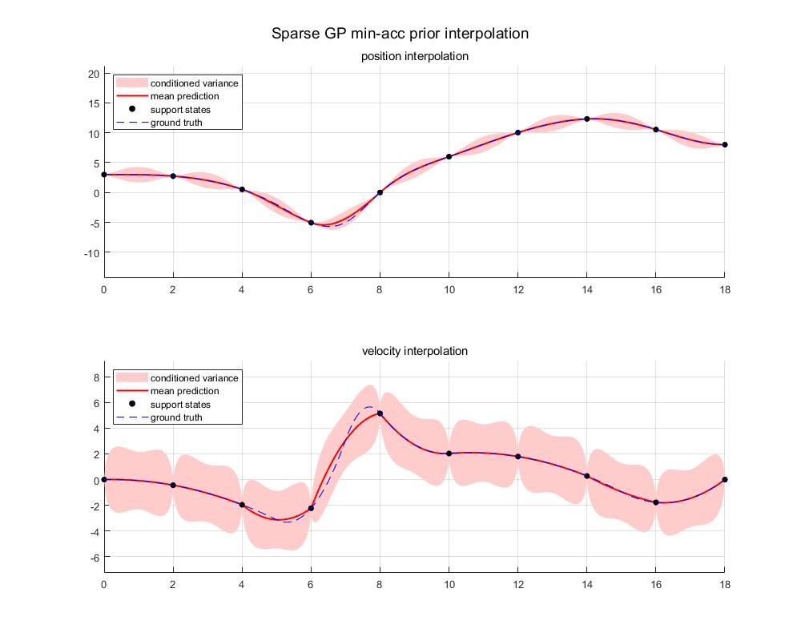

`min-Jerk prior`
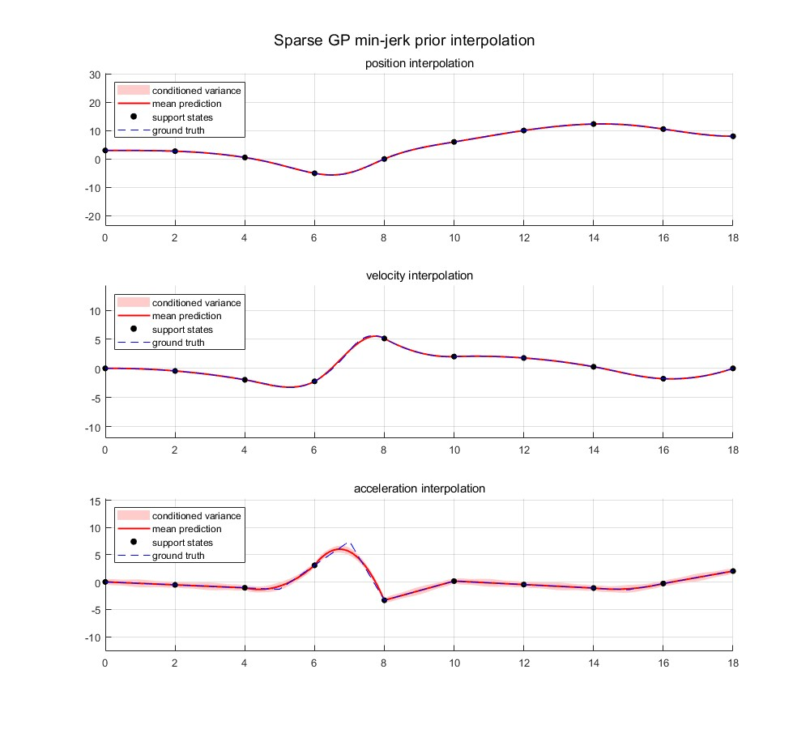

`min-Snap prior`
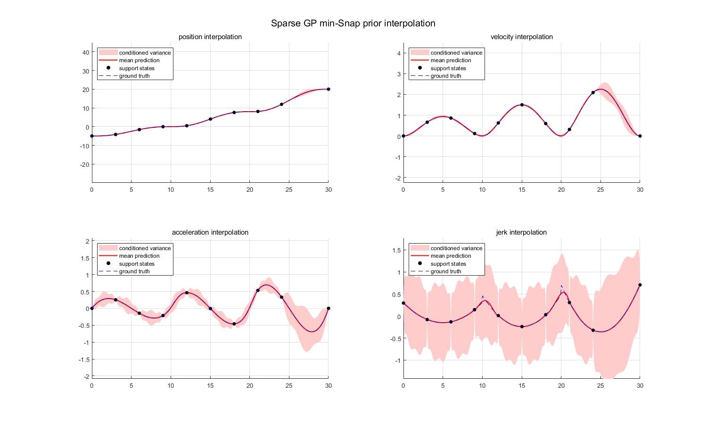

### (2) same interpolation results as polynomials
`min-acc prior gp(red solid) vs cubic polynomial(blue dash)`  
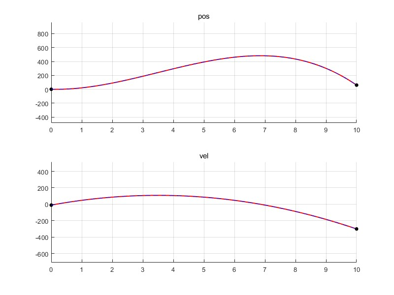

`min-jerk prior gp(red solid) vs quintic polynomial(blue dash)`  
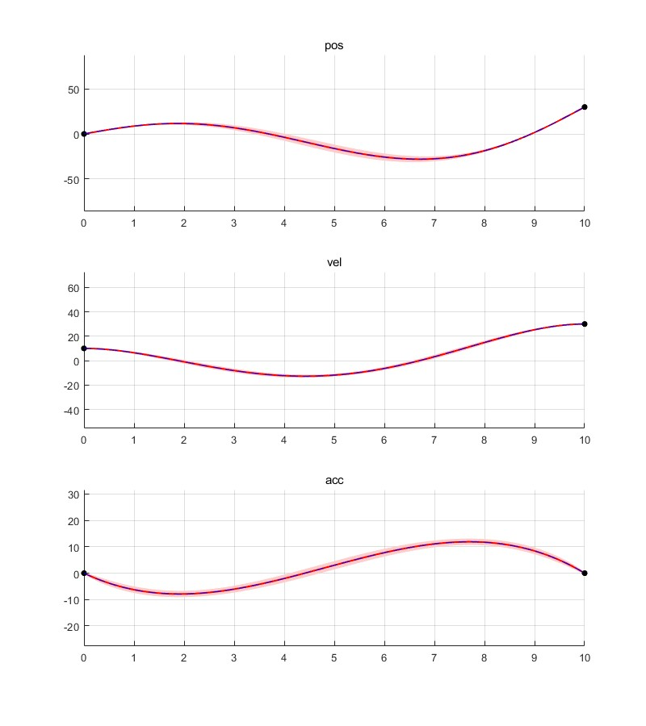

### (3) sparse GP smoothing on SO(3)
`test path`
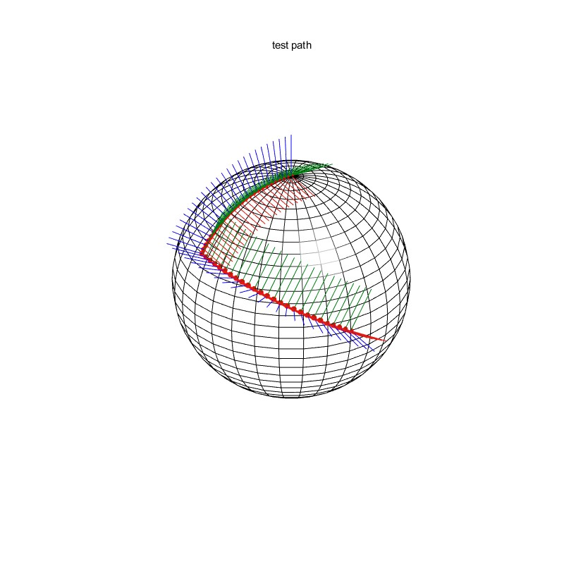

`min-Acc prior smoothing`
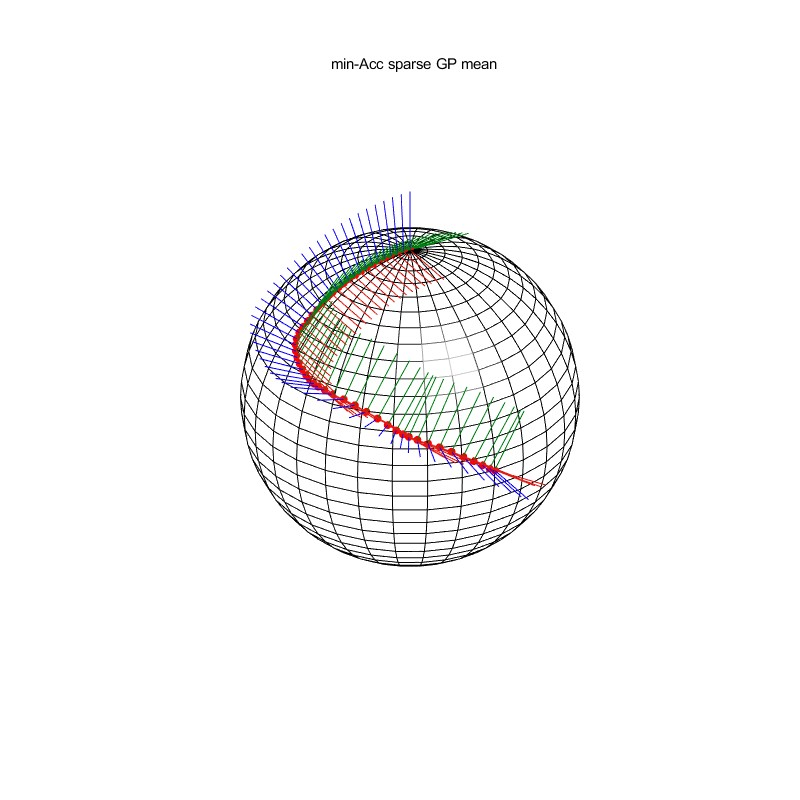

## 2.sparse GP motion planning

source codes in `/gpmp`

### 2-D point trajectory planning results: 
#### (1) unconstrained case:
```matlab
% init coeffs
omega = 3000; %obs cost coeffs
lambda = 1; %prior cost coeffs
eta = 100; %regularization coeffs

options = gpmp_optimset_init();
options.FixedStateId = [1, 5];
options.MaxIter = 500;
options.TolFun = 1e-2;
```

`path history:`   
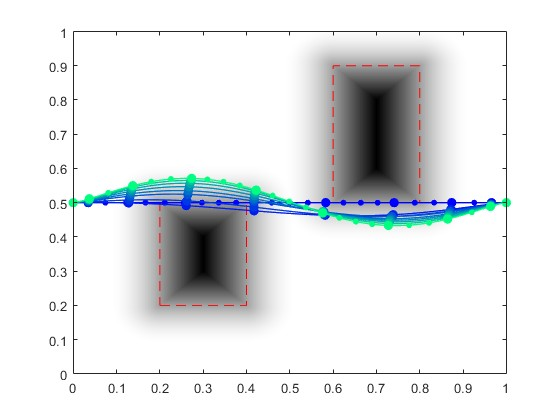

`speed profile:`  
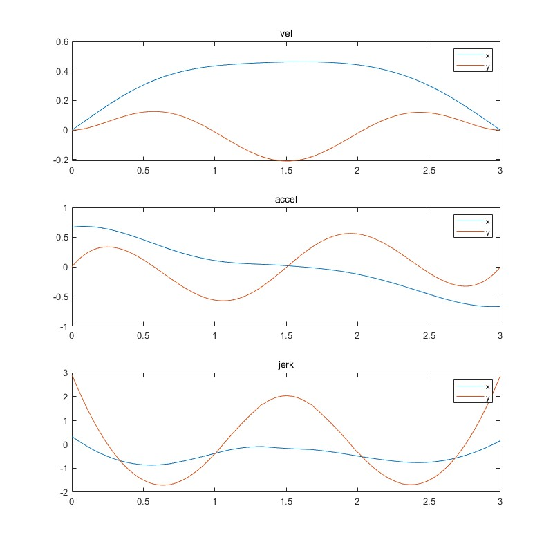

#### (2) constrained case:

`path history:`    
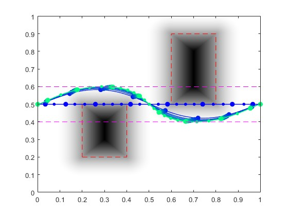

`speed profile:`  
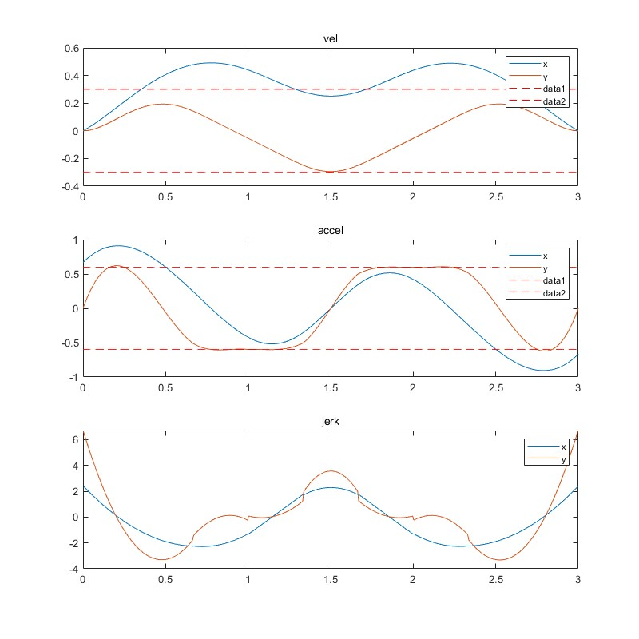